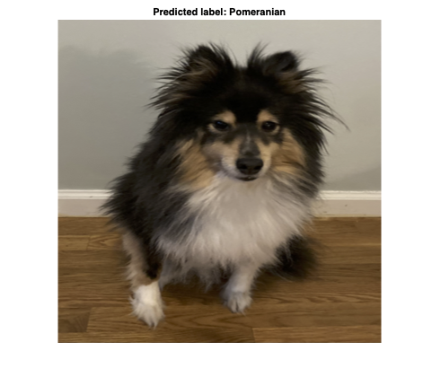

# Image Classification in MATLAB Using Converted TensorFlow Model
# Requirements


To run the following code in MATLAB®:


   -  MATLAB R2021a or later 
   -  Deep Learning Toolbox™ 
   -  Deep Learning Toolbox Converter for TensorFlow™ Models 


To obtain the TensorFlow model:


   -  TensorFlow r2.0 to r2.6 
   -  Python® 3.7 or later 

# Overview


This repository shows how to import a pretrained TensorFlow model in the SavedModel format, and use the imported network to classify an image. It is also referenced in the deep learning blog article [Importing Models from TensorFlow, PyTorch, and ONNX](https://blogs.mathworks.com/deep-learning/2022/03/18/importing-models-from-tensorflow-pytorch-and-onnx).


Use the [`importTensorFlowNetwork`](https://www.mathworks.com/help/deeplearning/ref/importtensorflownetwork.html) function to import the network. `importTensorFlowNetwork` requires the Deep Learning Toolbox Converter for TensorFlow Models support package. If this support package is not installed, then `importTensorFlowNetwork` provides a download link.


The TensorFlow model contains layers that are not supported for conversion into built-in MATLAB layers. The `importTensorFlowNetwork` function automatically generates custom layers when you import these layers.


# Convert TensorFlow Model into MATLAB Network
## Get TensorFlow Model


Use the code in `getefficientnetv2l.py` (in this repository) to get the TensorFlow model EfficientNetV2L from [tf.keras.applications](https://www.tensorflow.org/api_docs/python/tf/keras/applications).


## **Specify Class Names**


The EfficientNetV2L model is trained with images from the ImageNet database. Get the class names from `squeezenet`, which is also trained with ImageNet images.


```matlab:Code(Display)
squeezeNet = squeezenet;
ClassNames = squeezeNet.Layers(end).Classes;
```

## **Import Network**


Import the TensorFlow model EfficientNetV2L in the saved model format. By default, `importTensorFlowNetwork` imports the network as a `DAGNetwork` object. Specify the output layer type for an image classification problem.


Note that when you import the model, the software will throw warnings. The model is importable.


```matlab:Code(Display)
net = importTensorFlowNetwork("EfficientNetV2L",...
    OutputLayerType="classification",...
    Classes=ClassNames)
```


```text:Output
Importing the saved model...
Translating the model, this may take a few minutes...
Finished translation. Assembling network...
Import finished.
net = 
  DAGNetwork with properties:

         Layers: [1083x1 nnet.cnn.layer.Layer]
    Connections: [1216x2 table]
     InputNames: {'input_1'}
    OutputNames: {'ClassificationLayer_predictions'}

```


Find the autogenerated custom layers.


```matlab:Code(Display)
PackageName = '+EfficientNetV2L';
s = what(['.\' PackageName]);

ind = zeros(1,length(s.m));
for i = 1:length(net.Layers)
    for j = 1:length(s.m)
        if strcmpi(class(net.Layers(i)),[PackageName(2:end) '.' s.m{j}(1:end-2)])
            ind(j) = i;
        end
    end
end
ind
```


```text:Output
ind = 2
```


```matlab:Code
net.Layers(ind)
```


```text:Output
ans = 
  kRescalingLayer241559 with properties:

    Name: 'rescaling'

   Learnable Parameters
    No properties.

   State Parameters
    No properties.

  Show all properties

```


Analyze the imported network.


```matlab:Code(Display)
analyzeNetwork(net)
```

# Use Imported Network for Image Classification
## Read and Preprocess Image


Read the image you want to classify and display the size of the image.


```matlab:Code(Display)
Im = imread("mydog.jpg");
size(Im)
```


```text:Output
ans = 1x3    
        2647        1968           3

```


```matlab:Code(Display)
InputSize = net.Layers(1).InputSize;
```


Resize the image to the input size of the network.


```matlab:Code(Display)
Im = imresize(Im,InputSize(1:2));
```


The inputs to EfficientNetV2L require further preprocessing. Rescale the image. Normalize the image by subtracting the training images mean and dividing by the training images standard deviation.


```matlab:Code(Display)
ImProcessed = rescale(Im,0,1);
meanIm = [0.485 0.456 0.406];
stdIm = [0.229 0.224 0.225];
ImProcessed = (ImProcessed-reshape(meanIm,[1 1 3]))./reshape(stdIm,[1 1 3]);
```

## Classify Image


Predict and plot image with classification label.


```matlab:Code(Display)
label = classify(net,ImProcessed);
imshow(Im)
title(strcat("Predicted label: ",string(label)))
```





Copyright 2022, The MathWorks, Inc.


